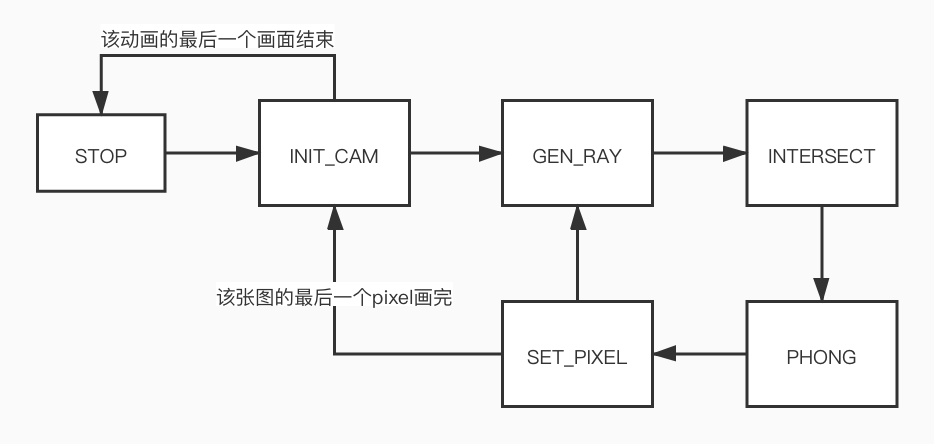

<h2>数字逻辑接口设计文档</h2>

<h3>edited by zwd&wzf</h3>

------

### 一、参数初步设计

（没写数据大小的是还没想好多大的或者还没想好数据结构的）

- 迷宫参数
  - maze[24:0] 迷宫布置 5*5
  - hor_wall[29:0] 水平方向的墙 6*5
  - ver_wall[29:0] 垂直方向的墙 6*5

- 相机参数
  - lights 光源
  - width 画面宽度
  - height 画面高度
  - center\[1:0\]\[width和height的数据大小\] 光心位置（设为画布中心吧就）
  - angle 视角（关乎视点到画布距离）
- 物理参数
  - material 材质
  - lc 光源颜色
  - ...
- ...

### 二、状态机初步设计

- 大状态机（多周期设计）
  - STILL 静止状态
  - MOVE 移动状态
  - ROTATE 转动状态

- 移动/转动状态（流水线设计）

  - STOP 未运行的
  - INIT_CAM：1 相机初始化
  - GEN_RAY：2 生成光线
  - INTERSECT：3 计算相交（这部分我觉得可以计划再分）
  - PHONG：4 光强计算（这部分根据不同光源我觉得也可再分）
  - SET_PIXEL：5 存这个pixel 存入sram

  设想的状态：

  

### 三、变量初步设计

- 状态机变量

  - state 多周期状态机指示

- 渲染状态变量

  - 全状态变量（可能需要（流水线周期数）份）

    - pos\[1:0\]\[2:0\] 当前位置
    - direction\[1:0\]\[7:0\] 朝向，arctan(y/x)和arctan(z/x)
    - px, py 像素点位置

  - 中间变量
    - 1-2 

      应该无

    - 2-3

      - r_direc 光线方向

    - 3-4

      - hit 是否击中
      - t 击中位置
      - normal 我忘了是啥了反正是hit参数

    - 4-5

      - fc 该点光强

### 四、接下来可能要着重克服的问题

- 进入绘制的状态机edge case的处理

- vga模块的耦合

